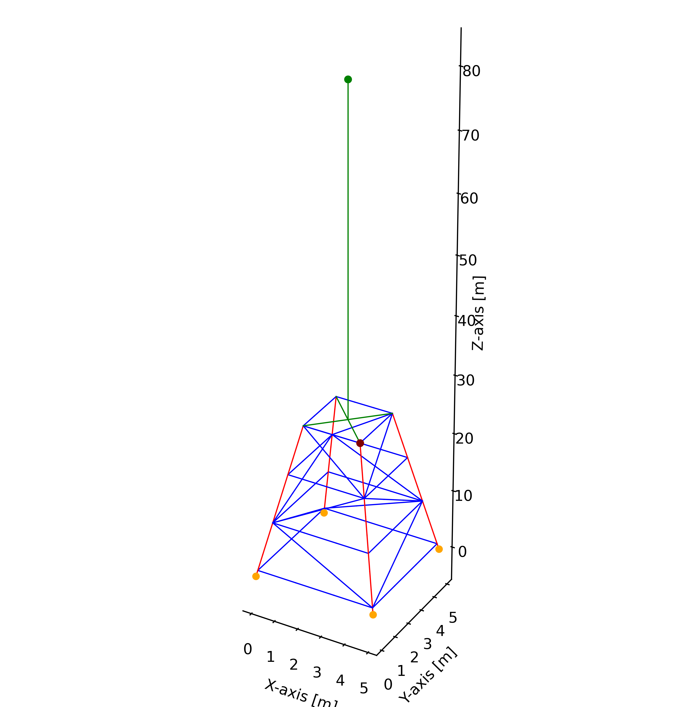

# MECA0029–1 Theory of Vibration

## Analysis of the Dynamic Behaviour of an Offshore Wind Turbine Jacket

### Academic Year 2023 – 2024

  

This repository contains the code and documentation for the MECA0029–1 Theory of Vibration project for the academic year 2023–2024. The project focuses on the analysis of the dynamic behavior of an offshore wind turbine jacket.

## Table of Contents

- [Introduction](#introduction)
- [Usage](#usage)
- [Results](#results)

## Introduction

This project is due to 3 part the first one we going to calculate the natural frequency and the mode shape of the jacket. The second part we going to calculate the response of the jacket with crew of  gang of killer whales. And finaly the last we going to try to reduce this methodes. 

## Usage
The code is really simple to use, you just need to run the main.py file and the code will run automaticly. Like the code is really heavi we install somme parametere for going faster. So if you want to take in this acount just change the parameters

```bash
write_e_n       = False      # if you want to write the new nodes and element in a file and the answers
actu_graph      = False      # if you want actualisée graph
c_time          = True       # if you want to calcul the time of part of the programm
nb_elem_by_leg  = 3          #number of element by leg
nMode           = 8          # nombre de mode a calculer,nombre de mode inclus dans la superoposition modale max 8
```	
The code is base on node and element on the jacket list that you can find in data/init_nodes.txt, if you want to change the structure you need to change it. But be carefile beacausse the code is not really flexible. We fixe somme rigid element,some leg element and clamped nodes. That you can see in green and red in the graph.

  

## Results

The result going to be show in the terminal and in the graph. The graph is going to be save in the folder picture The result is going to be save in the folder data/result.
